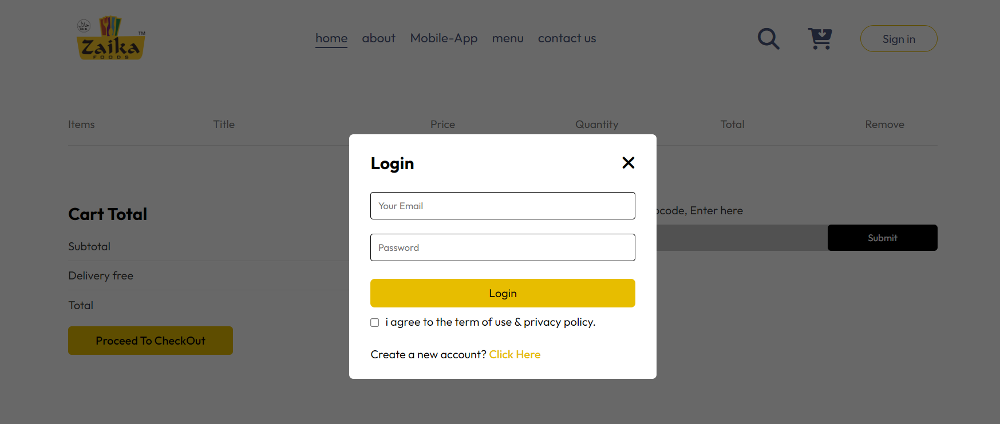
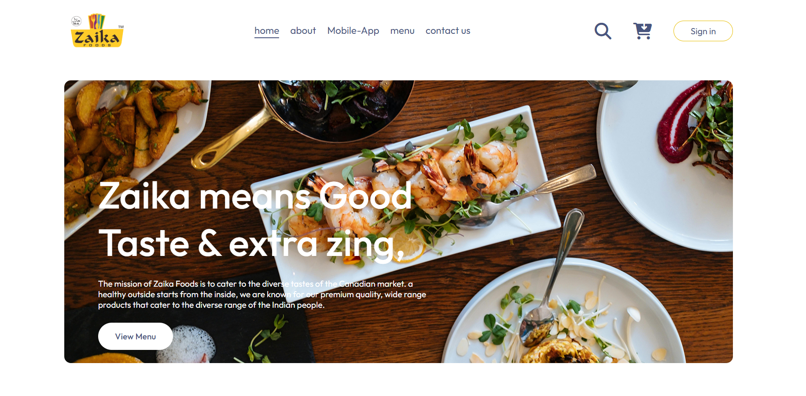
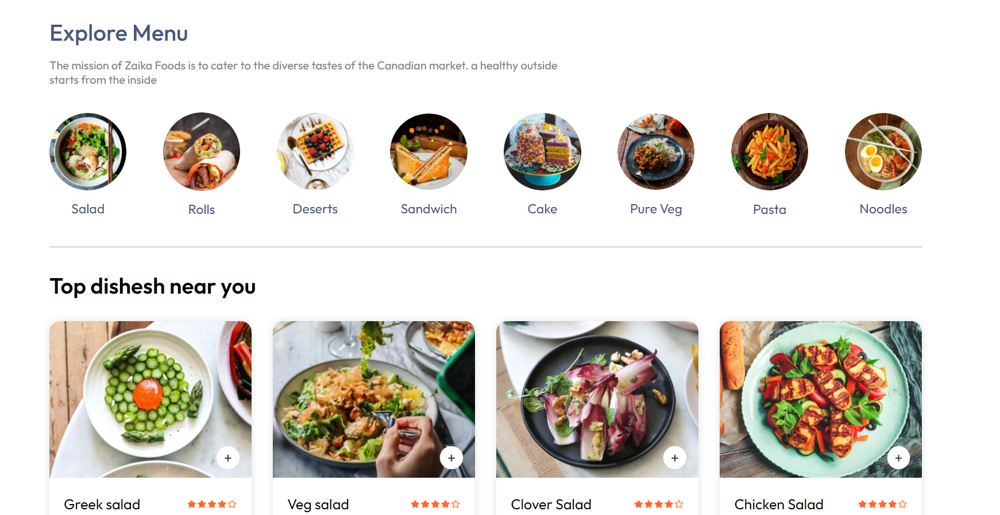
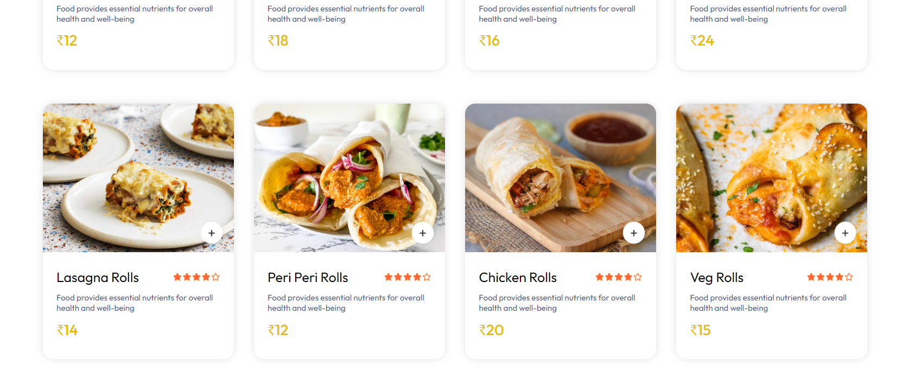
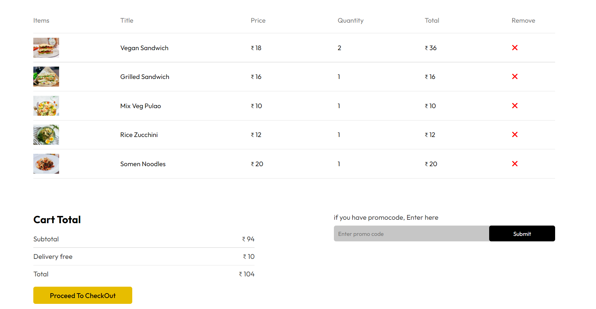
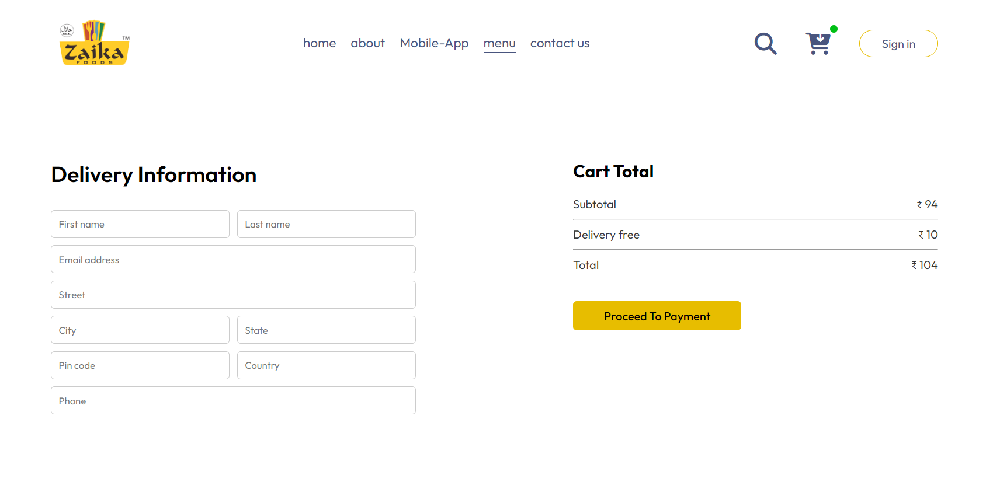

----- Restaurante Food Order React App -----

# React + Vite
## Restaurante Food Order React App
### [Watch it on youtube] (https://www.youtube.com/channel/UCdPcN2ibTMK5adKU3baLcOA)
#### Follow On Instagram If Any help : https://www.instagram.com/mr.attitude_sz/

- Responsive react App.
- Contains animations when scrolling.
- Smooth scrolling in each section.
- Developed first with the Mobile First methodology, then for desktop.
- Compatible with all mobile devices and with a beautiful and pleasant user interface.

💙 Join the channel to see more videos like this. [shahbaz] (https://www.youtube.com/channel/UCdPcN2ibTMK5adKU3baLcOA)

portfolio Live Link: https://mdshahbazansari.github.io/Portfolio-shahbaz/

This template provides a minimal setup to get React working in Vite with HMR and some ESLint rules.

Currently, two official plugins are available:

- [@vitejs/plugin-react](https://github.com/vitejs/vite-plugin-react/blob/main/packages/plugin-react/README.md) uses [Babel](https://babeljs.io/) for Fast Refresh
- [@vitejs/plugin-react-swc](https://github.com/vitejs/vite-plugin-react-swc) uses [SWC](https://swc.rs/) for Fast Refresh
